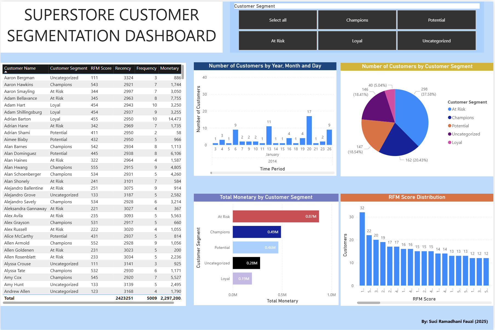
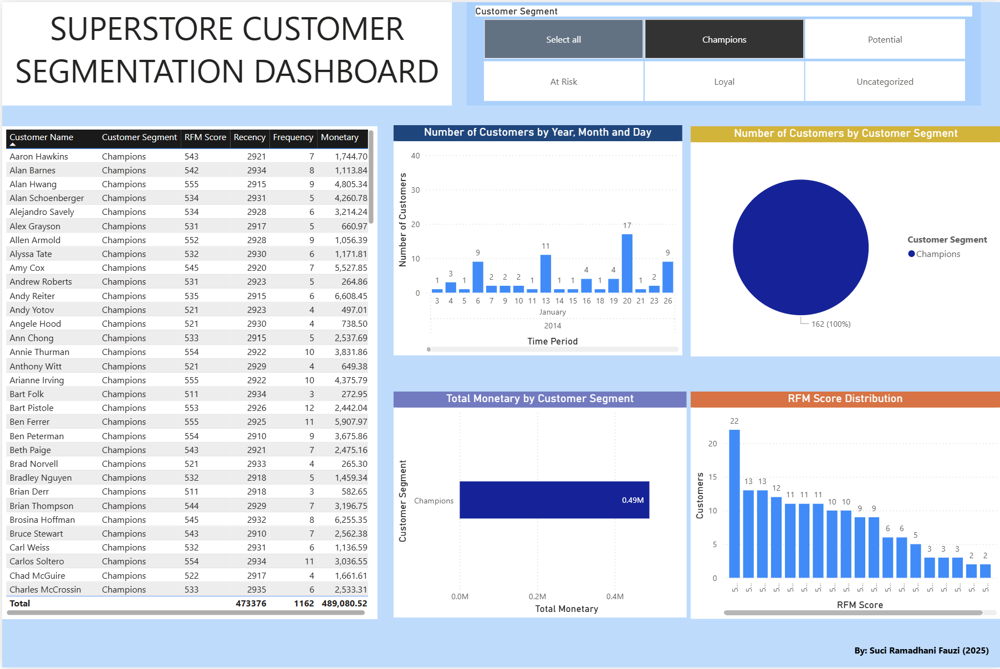
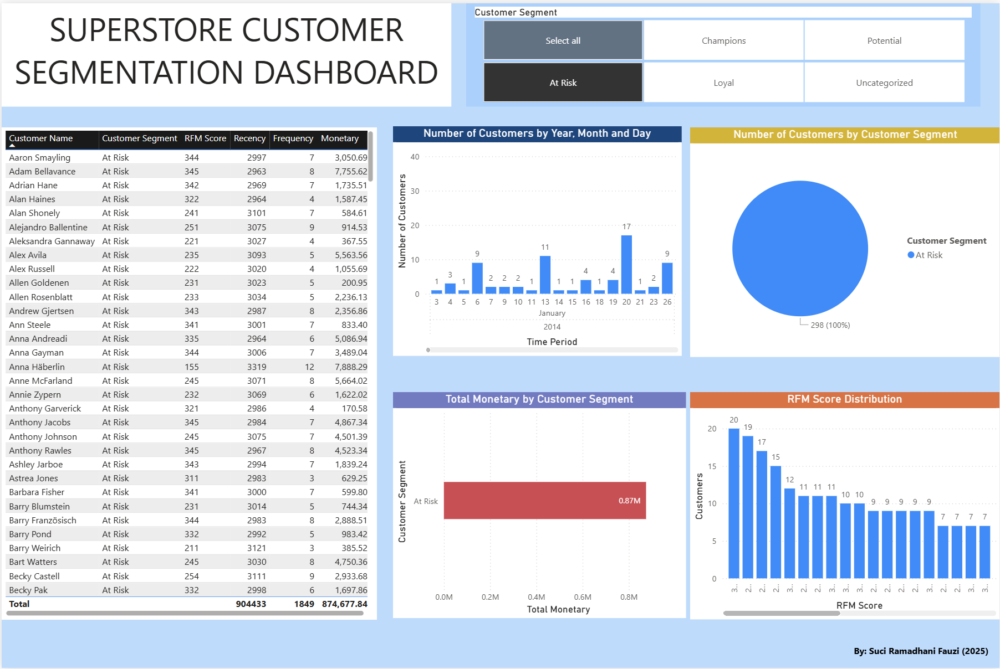
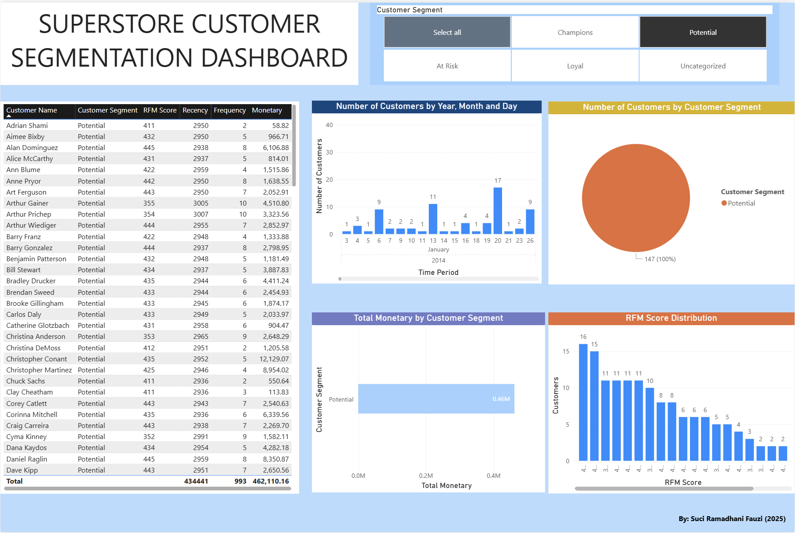

# Customer Segmentation using RFM Analysis (Superstore Dataset)
Understanding customer behavior is critical for retention and revenue growth.
This project applies RFM (Recency, Frequency, Monetary) analysis on the Superstore dataset
to segment customers into actionable groups and translate insights into marketing strategies.

## Dataset
* Dataset: Superstore
* Records: Orders & customer-level transactions
* Tools: Power BI

## Methodology
1. Calculated Recency, Frequency, and Monetary metrics per customer
2. Assigned RFM scores using quantile-based scoring
3. Mapped customers into business-friendly segments:
   - Champions
   - Loyal
   - Potential
   - At Risk
   - Uncategorized
4. Built an interactive Power BI dashboard with segment filters

## Dashboard Overview
The dashboard allows users to:
- Filter customers by segment
- Explore customer distribution over time
- Analyze revenue contribution by segment
- Inspect RFM score distributions

## Key Insights
- **At Risk** customers represent the largest group and the highest historical revenue (~0.87M),
  but show poor recency, indicating a major revenue leakage risk.
- **Champions** contribute high value (~0.49M) despite smaller volume, making them key retention assets.
- **Potential** customers show strong recency but low frequency, signaling high conversion opportunity.
- **Uncategorized** customers are mostly low-value one-time buyers but represent a low-cost acquisition funnel.

## Segment Deep-Dive
### 1. Champions
**Profile**
- High recency, frequency, and monetary value
- Core revenue drivers

**Recommended Actions**
- VIP / loyalty programs
- Early access & premium bundles
- Referral incentives

**Key KPIs**
- Repeat rate
- CLV
- Basket size

### 2. At Risk
**Profile**
- High historical value
- Poor recency (long time since last purchase)

**Recommended Actions**
- Reactivation campaigns
- Personalized reminders
- Limited-time offers

**Key KPIs**
- Reactivation rate
- GMV post-reactivation (30–60 days)

### 3. Potential
**Profile**
- Recent buyers with low frequency
- High growth potential

**Recommended Actions**
- Onboarding campaigns
- Second-purchase incentives
- Product recommendations

**Key KPIs**
- Time-to-second-purchase
- 90-day retention

## Business Impact
This segmentation enables:
- Targeted marketing instead of blanket promotions
- Better allocation of retention budget
- Early detection of churn risk
- Clear prioritization of customer lifecycle strategies

## Tool & Skill Highlight
**Skills Demonstrated**
- Customer segmentation (RFM)
- Business-driven analytics
- Power BI dashboard design
- Data storytelling & insight communication
